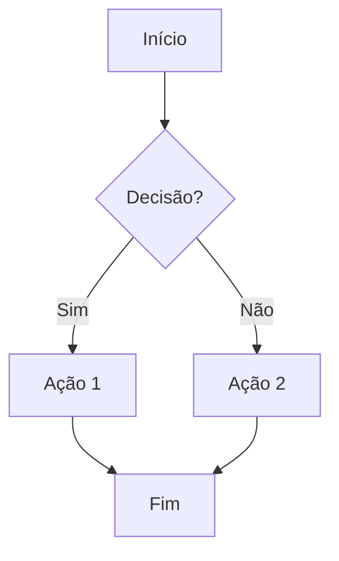
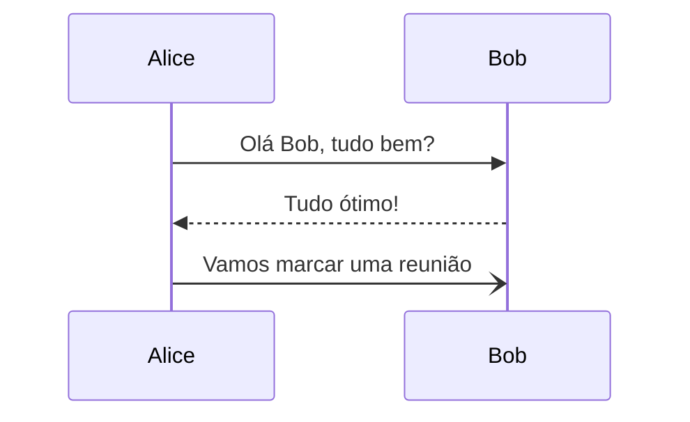
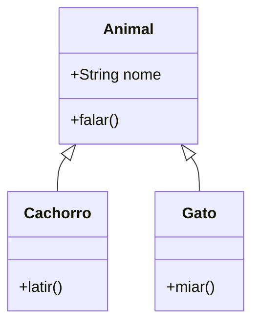
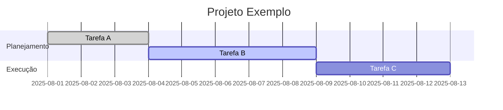

# Markdown e Mermaid


> Este guia mostra como usar Markdown e Mermaid com exemplos práticos.

## Introdução
- O Markdown é uma linguagem de marcação leve, amplamente utilizada para criar documentação, READMEs e conteúdo em plataformas como GitHub, GitLab e Bitbucket.

## Sintaxe Básica do Markdown

### 1. Títulos
- Utilizamos # na frente dos títulos. A quantidade de # determina o tamanho do título.
```
# Título 1
## Título 2
### Título 3
#### Título 4
```
- Resultado:
# Título 1
## Título 2
### Título 3
#### Título 4
--- 

### 2. Texto
- Para deixar negrito, itálico, texto riscado e código inline
```
  **Negrito**  
*Itálico*  
~~Texto riscado~~  
`Código inline`
```
- Resultado:
**Negrito**  
*Itálico*  
~~Texto riscado~~  
`Código inline`
---

### 3. Listas e citações
- Para efeito lista usamos - e numerações 1 e citação usamos >
```
- Item 1
- Item 2
  - Subitem
1. Item numerado
2. Outro item
> Citação 1
>
> Citação 2
```
- Resultado:
- Item 1
- Item 2
  - Subitem
1. Item numerado
2. Outro item
> Citação 1
> 
> Citação 2
> 
---

### 4. Links e imagens
- O markdown não suporta vídeos diretos, apenas gifs. Para usar gifs você deve ter eles importado dentro da pasta.
```
[Visite o GitHub](https://github.com)


```
- Resultado:
[Visite o GitHub](https://github.com)


---

### Blocos de código
- Você adicionar ``` em cima e em baixo da parte que quer que vire código, e pode colocar uma anotação como bash ou java para diferenciar da seguinte forma:


- Resultado Com Java e Bash e json:
```java
public class HelloWorld {
    public static void main(String[] args) {
        System.out.println("Olá, Mundo!");
    }
}
```
```bash
public class HelloWorld {
    public static void main(String[] args) {
        System.out.println("Olá, Mundo!");
    }
}
```
```json
{
  "id": 1,
  "nome": "Mateus",
  "email": "mateus@email.com"
}
```
--- 
### Tabelas
- Você faz da seguinte forma:
```
<table>
  <tr>
    <th>Nome</th>
    <th>Idade</th>
    <th>Cidade</th>
  </tr>
  <tr>
    <td>Joaquim</td>
    <td>32</td>
    <td>Curitiba</td>
  </tr>
  <tr>
    <td>Ana</td>
    <td>25</td>
    <td>São Paulo</td>
  </tr>
</table>

```
- Resultado:
<table>
  <tr>
    <th>Nome</th>
    <th>Idade</th>
    <th>Cidade</th>
  </tr>
  <tr>
    <td>Joaquim</td>
    <td>32</td>
    <td>Curitiba</td>
  </tr>
  <tr>
    <td>Ana</td>
    <td>25</td>
    <td>São Paulo</td>
  </tr>
</table>

  > Dá pra utilizar de algumas anotações HTML
 ---
### Links com botões
```java
<p align="center">
  <a href="https://github.com" target="_blank">
    
  </a>
</p>
```
- Resultado:
<p align="center">
  <a href="https://github.com/andressasmedeiros" target="_blank">
    
  </a>
</p>

---

### Colapsar conteúdo (toggle)

```java
<details>
  <summary>📜 Clique para expandir</summary>
  <p>Esse texto fica oculto até o usuário clicar.</p>
</details>
```
- Resultado:
<details>
  <summary>📜 Clique para expandir</summary>
  <p>Esse texto fica oculto até o usuário clicar.</p>
</details>

---

### Layouts customizados
```
<div style="display: flex; justify-content: space-around;">
  
  
</div>

```

- Resultado:
<div style="display: flex; justify-content: space-around;">
  
  
</div>

---

### Badges (etiquetas)
```


```

- Resultado:


--- 

# Mermaid

## Introdução
- O Mermaid é uma extensão compatível com Markdown que permite criar diagramas e gráficos diretamente em arquivos .md usando código simples e intuitivo.

### Fluxograma (Flowchart)
```


- Resultado:


---

### Diagrama de sequência
```

- Resultado:


--- 

### Diagrama de classe
```


- Resultado:


### Gráfico de Gantt (para cronogramas)
```


- Resultado:


---
>  https://mermaid.js.org/ onde você encontra a documentação completa, tutoriais, guias de sintaxe
---
